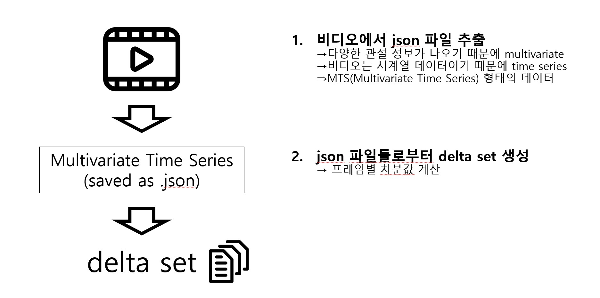

# GRU 기반 이상 탐지 및 평가 기법 개발: ASD 아동의 다감각 프로그램 적용

## 요약

>이 연구는 Creamo의 ASD 아동 대상 다감각 치료 프로그램에서 아동의 성취도 평가(Hand Manipulation, Pose Stability, Bilateral Hand use)와 프로그램 도중 이상행동(Hand Flapping, Body Rocking, Sit up & Sit down 등) 탐지를 위해 GRU 기반의 이상 탐지 및 평가 기법을 개발을 목적으로 진행하였습니다.

## 서론

>Autism Spectrum Disorder(ASD)은 전 세계적으로 빠르게 증가하는 발달 장애로 조기 치료와 개입을 통해 그 증세를 크게 완화시킬 수 있습니다[1]. 이에 따라, ASD 아동 대상 다감각 치료 프로그램에 대한 평가와 이상행동 탐지에 대한 필요성이 높아지고 있습니다. 그러나 ASD 아동에 대한 조기 진단과 치료에는 많은 시간이 소요되고, 환자 수의 증가와 진단 및 치료를 담당할 전문인력의 부족이 맞물려 많은 ASD 아동들이 제때 적절한 조치를 받지 못하는 상황으로 이어졌습니다. 이러한 배경 속에서 ASD의 진단 및 치료 인력의 부족 문제를 해결하고자 머신 러닝을 ASD 아동의 진단에 사용하려는 선행연구들이 있었고 이들을 바탕으로 연구를 진행하게 되었습니다.

  
>먼저"Development and Validation of a Joint Attention-Based Deep Learning System for Detection and Symptom Severity Assessment of Autism Spectrum Disorder"[1]에서는 CNN-LSTM 구조를 기반으로 TD와 ASD 아동들의 video data를 분석하여 아동들의 ASD severity를 높은 정확도로 예측하는데 성공하였습니다. 또한 "The Classification of Abnormal Hand Movement to Aid in Autism Detection: Machine Learning Study"[3]에서는 Google mediapipe를 기반으로, ASD 아동들에게서 흔히 보여지는 이상행동인 Hand Clapping을 detect하는데 성공하였습니다. 이러한 선행 연구들을 바탕으로 머신러닝을 기반으로한 ASD 아동들의 성취도 평가와 이상행동 탐지의 가능성을 확인하였고 이를 Creamo에서도 사용할 수 있게 만들고자 개발을 시작하였습니다.

## 연구 방법
>본 연구는 Google Mediapipe의 Hand Gesture & Pose Detection을 통해 몸의 landmark들의 좌표 데이터를 input으로 받아서 .json파일로 DB에 저장해놓았다는 것을 전제로 하고 진행하였습니다. 앞선 연구들에선 비디오 분석에 Long Short-Term Memory(LSTM)을 활용하였으나, 본 연구에서는 LSTM과 성능은 비슷하면서도 더 가벼운 모델인 Gated Recurrent Unit(GRU)을 사용하여 진행하였습니다.
>
## 프로그램 구성
> ### 먼저 mediapipe로부터 추출된 landmark들의 json파일들로부터 delta dataset을 생성합니다.

> ### 이후 delta dataset에 라벨링을 한 이후 이를 GRU 모델 Train에 사용합니다.

> ### 훈련된 GRU 모델을 바탕으로 대상 비디오에 대해 window를 움직여가며 inference 결과를 도출합니다

> ### 이후 도출된 결과를 predict_data에 json파일 형태로 저장합니다.


## 프로그램 Tree구조도
    /YourProjectPATH
    │
    ├── main.py
    ├── config.py
    ├── requirements.txt
    ├── src
    │ ├── data_loader.py
    │ ├── model_builder.py
    │ ├── train.py
    │ └── inference.py
    └── DB
    │ ├── AssessmentClip
    │ │ ├── HM
    │ │ └── PS
    │ ├── DetectionClip
    │ ├── TDvideos
    │ └── ASDvideos

## 프로그램 구조 설명

#### - `main.py`: 프로그램의 진입점입니다. 이 파일을 실행하여 모델 훈련 및 추론을 시작합니다.
#### - `config.py`: 프로그램 설정을 관리하는 파일입니다. 여기에서 경로, 하이퍼파라미터 등의 설정을 변경할 수 있습니다.
#### - `requirements.txt`: 프로그램 실행에 필요한 파이썬 라이브러리와 그 버전이 명시되어 있습니다. 이를 통해 필요한 라이브러리를 한번에 설치할 수 있습니다.

#### - `src` 폴더: 소스 코드를 관리하는 폴더입니다.
####   - `data_loader.py`: 데이터 로딩 및 전처리를 담당하는 파일입니다. 입력 데이터를 모델에 적합한 형태로 변환합니다.
####   - `model_builder.py`: GRU 기반의 모델을 생성하는 파일입니다. 모델의 구조를 정의하고 훈련 방법을 설정합니다.
####   - `train.py`: 모델을 훈련시키는 파일입니다. 설정된 에포크 수만큼 훈련을 반복하며, 각 에포크마다 훈련 결과를 출력합니다.
####   - `inference.py`: 훈련된 모델을 이용해 새로운 데이터에 대한 추론을 수행하는 파일입니다.

#### - `DB` 폴더: 데이터를 저장하는 폴더입니다.
####   - `AssessmentClip`, `DetectionClip`, `TDvideos`, `ASDvideos`: 각각 다른 종류의 비디오 클립들을 저장하는 폴더입니다. 


## 설치 및 실행 방법
본 연구를 진행하기 위한 환경 구축 및 실행 방법은 아래와 같다. 

### 1) 가상환경 생성

#### 아나콘다 프롬프트를 사용하여 가상환경을 구축할 수 있다. 이 프로젝트에서 개발에 사용한 파이썬 버전은 3.11.5이다.

```Anaconda Prompt
conda create --name 가상환경이름 python=3.11.5
```

이후 가상환경을 활성화 한다

```Anaconda Prompt
conda activate 가상환경이름
```

아래 명령을 따라 Pytorch module을 설치한다. 

CPU 버전 : 
```Anaconda Prompt
conda install pytorch torchvision torchaudio cpuonly -c pytorch
```
GPU 버전 (CUDA 지원이 있는 경우):
```Anaconda Prompt
conda install pytorch torchvision torchaudio cudatoolkit=11.1 -c pytorch
```

### 2) Model 동작 확인을 위한 dummy file 생성법

현재는 DB폴더에 .json 파일들이 비어있으므로, dummy data를 생성하여 모델의 동작을 확인하여야 한다.

일단 HM에 대해서 dummy data를 만드는 코드는 다음과 같다

```
import os
import json
import torch
import random

# 함수: JSON 파일 생성
def create_json_file(root_dir, videocliptype, clipnumber, userid, hand, landmarkname):
    # 파일 이름 생성
    file_name = f"{videocliptype}_{clipnumber}_{userid}_{hand}_{landmarkname}.json"
    file_path = os.path.join(root_dir, file_name)

    # (60, 3) 모양의 랜드마크 데이터 생성 (평균=0, 표준편차=1의 정규분포)
    landmark_data = torch.randn(60, 3)

    # JSON 파일에 랜드마크 데이터 저장
    with open(file_path, 'w') as file:
        json.dump(landmark_data.tolist(), file)

# 랜드마크 이름 목록
landmark_names = [
    "hand_wrist", "thumb_cmc", "thumb_mcp", "thumb_ip", "thumb_tip",
    "indexfinger_mcp", "indexfinger_pip", "indexfinger_dip", "indexfinger_tip",
    "middlefinger_mcp", "middlefinger_pip", "middlefinger_dip", "middlefinger_tip",
    "ringfinger_mcp", "ringfinger_pip", "ringfinger_dip", "ringfinger_tip",
    "pinkyfinger_mcp", "pinkyfinger_pip", "pinkyfinger_dip", "pinkyfinger_tip"
]

# 루트 디렉토리
root_dir_template = "YourProjectPATH/DB/AssessmentClip/HM/HM{}"

# 클립 타입, HM 넘버, 클립 번호에 따라 파일 생성
for hm_number in range(1, 9):
    for i in range(1, 21):
        videocliptype = f"HandManipulation{hm_number}"
        root_dir = root_dir_template.format(hm_number)
        
        # 같은 HM 넘버 내에서 같은 클립 넘버에 대해 같은 사용자 ID를 유지
        userid = str(random.randint(100000, 999999))  # 6자리 숫자 랜덤 생성
        for hand in ["left", "right"]:
            for _ in range(21):  # 21개의 랜드마크 (left + right)
                for landmarkname in landmark_names:
                    create_json_file(root_dir, videocliptype, i, userid, hand, landmarkname)
```

Inference 실행을 위한 dummy data를 만드는 코드는 다음과 같다

```
import os
import json
import torch
import random

# 함수: JSON 파일 생성
def create_json_file(root_dir, videocliptype, clipnumber, userid, hand, landmarkname):
    # 파일 이름 생성
    file_name = f"{videocliptype}_{clipnumber}_{userid}_{hand}_{landmarkname}.json"
    file_path = os.path.join(root_dir, file_name)

    # (50000, 3) 모양의 랜드마크 데이터 생성 (평균=0, 표준편차=1의 정규분포)
    landmark_data = torch.randn(50000, 3)

    # JSON 파일에 랜드마크 데이터 저장
    with open(file_path, 'w') as file:
        json.dump(landmark_data.tolist(), file)

# 랜드마크 이름 목록
landmark_names = [
    "hand_wrist", "thumb_cmc", "thumb_mcp", "thumb_ip", "thumb_tip",
    "indexfinger_mcp", "indexfinger_pip", "indexfinger_dip", "indexfinger_tip",
    "middlefinger_mcp", "middlefinger_pip", "middlefinger_dip", "middlefinger_tip",
    "ringfinger_mcp", "ringfinger_pip", "ringfinger_dip", "ringfinger_tip",
    "pinkyfinger_mcp", "pinkyfinger_pip", "pinkyfinger_dip", "pinkyfinger_tip"
]

# 루트 디렉토리
root_dir_template = r"C:/Users/PJO/23kist/GRU_project_kist_PiljunOh/DB/TDvideos"

# 클립 타입, HM 넘버, 클립 번호에 따라 파일 생성
for clipnumber in range(1, 6):  # Modified to iterate over clip numbers from 1 to 5
    videocliptype = f"TDVideos"
    root_dir = root_dir_template
    
    # 같은 HM 넘버 내에서 같은 클립 넘버에 대해 같은 사용자 ID를 유지
    userid = str(random.randint(100000, 999999))  # 6자리 숫자 랜덤 생성
    for hand in ["left", "right"]:
        for landmarkname in landmark_names:
                create_json_file(root_dir, videocliptype, clipnumber, userid, hand, landmarkname)
```
---

## 3. Execution
> ### 가상환경에서 명령 프롬프트로 진입하여 다음 명령어를 입력한다
 ```Anaconda prompt
python main.py
```
> ### 이후 "실행 모드를 선택하세요 (train/inference):" 라는 말이 나오면 실행하고자 하는 모드를 입력하면 된다.
> #### train 입력시: "훈련할 데이터셋 타입을 선택하세요 (hm/ps):" 라고 출력하는데 어떤 데이터셋을 훈련시킬지 선택하면 된다. ps의 경우 아직 dummy data가 없으므로 hm으로 진행하여 테스트 해볼 수 있다.
> #### hm을 입력하면 훈련이 진행되고, 훈련된 GRU의 가중치가 models에 .pth파일로 저장되게 된다.
> 
> #### inference 입력시: "분석할 비디오 타입을 선택하세요 (TD/ASD):" 라고 출력하는데, 어떤 비디오 타입을 inference할건지 선택하면 된다. asd의 경우 아직 dummy data가 없으므로 td으로 진행하여 테스트 해볼 수 있다.
> #### td를 입력하면 "분석할 클립 넘버를 선택하세요:"라고 출력하고, 1~5까지의 수를 입력하면 된다. (dummy data에서 5까지밖에 생성하지 않음)
> #### 이후 hm을 선택하면 inference를 진행하고 결과를 predict_data에 저장한다.
---
## 4. Limitation


---
## 5. Lisence
## License for PyTorch

PyTorch is provided under the terms of the BSD 3-Clause License. The following is a copy of the license:

BSD 3-Clause License

Copyright (c) 2018, The PyTorch Authors
All rights reserved.

Redistribution and use in source and binary forms, with or without modification, are permitted provided that the following conditions are met:

1. Redistributions of source code must retain the above copyright notice, this list of conditions and the following disclaimer.

2. Redistributions in binary form must reproduce the above copyright notice, this list of conditions and the following disclaimer in the documentation and/or other materials provided with the distribution.

3. Neither the name of the copyright holder nor the names of its contributors may be used to endorse or promote products derived from this software without specific prior written permission.

THIS SOFTWARE IS PROVIDED BY THE COPYRIGHT HOLDERS AND CONTRIBUTORS "AS IS" AND ANY EXPRESS OR IMPLIED WARRANTIES, INCLUDING, BUT NOT LIMITED TO, THE IMPLIED WARRANTIES OF MERCHANTABILITY AND FITNESS FOR A PARTICULAR PURPOSE ARE DISCLAIMED. IN NO EVENT SHALL THE COPYRIGHT HOLDER OR CONTRIBUTORS BE LIABLE FOR ANY DIRECT, INDIRECT, INCIDENTAL, SPECIAL, EXEMPLARY, OR CONSEQUENTIAL DAMAGES (INCLUDING, BUT NOT LIMITED TO, PROCUREMENT OF SUBSTITUTE GOODS OR SERVICES; LOSS OF USE, DATA, OR PROFITS; OR BUSINESS INTERRUPTION) HOWEVER CAUSED AND ON ANY THEORY OF LIABILITY, WHETHER IN CONTRACT, STRICT LIABILITY, OR TORT (INCLUDING NEGLIGENCE OR OTHERWISE) ARISING IN ANY WAY OUT OF THE USE OF THIS SOFTWARE, EVEN IF ADVISED OF THE POSSIBILITY OF SUCH DAMAGE.


## 6. Reference
1. Estes A, Munson J, Rogers SJ, Greenson J, Winter J, Dawson G. Long-term outcomes of early intervention in 6-year-old children with autism spectrum disorder. J Am Acad Child Adolesc Psychiatry 2015 Jul;54(7):580-587 [FREE Full text] doi: 10.1016/j.jaac.2015.04.005 [Medline: 26088663]
2. Ko C, Lim JH, Hong J, Hong SB, Park YR. Development and Validation of a Joint Attention-Based Deep Learning System for Detection and Symptom Severity Assessment of Autism Spectrum Disorder. JAMA Netw Open. 2023 May 1;6(5):e2315174. doi: 10.1001/jamanetworkopen.2023.15174. Erratum in: JAMA Netw Open. 2023 Jul 3;6(7):e2324944. PMID: 37227727; PMCID: PMC10214037.
3. Lakkapragada A, Kline A, Mutlu O, Paskov K, Chrisman B, Stockham N, Washington P, Wall D The Classification of Abnormal Hand Movement to Aid in Autism Detection: Machine Learning Study. JMIR Biomed Eng 2022;7(1):e33771
doi: 10.2196/33771
